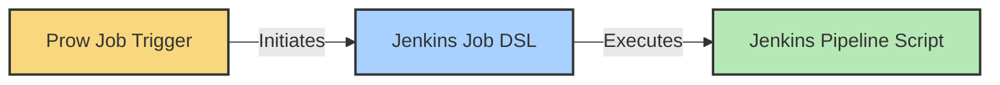
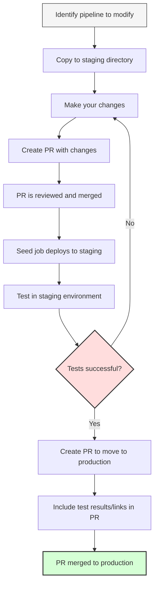
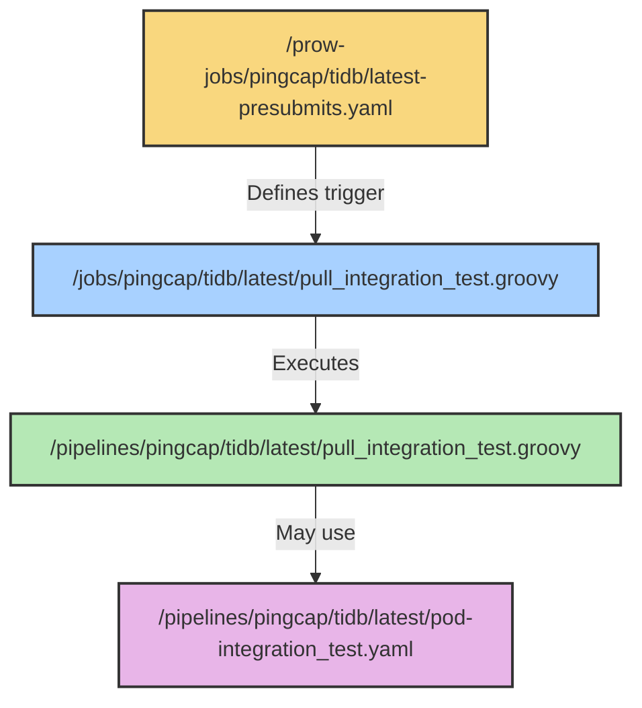

# PingCAP CI/CD Public Configurations

This repository maintains CI/CD configurations for repositories under PingCAP, TiKV and other related organizations. It contains both trigger configurations and detailed pipeline implementations.

## CI Pipeline Components and Structure

A complete CI pipeline consists of three main components:



| Component | Location | Purpose |
|-----------|----------|---------|
| **Prow Job Trigger** | `/prow-jobs/<org>/<repo>/` | Defines when and under what conditions jobs run |
| **Jenkins Job DSL** | `/jobs/<org>/<repo>/` | Configures the Jenkins job settings and parameters |
| **Jenkins Pipeline Script** | `/pipelines/<org>/<repo>/` | Contains the actual implementation steps |

## CI Servers

### Current CI Server

- `do.pingcap.net`
  - https://do.pingcap.net/jenkins is the backend CI worker (Jenkins)

### Deprecated Servers (To be archived)

- https://ci.pingcap.net
- https://ci2.pingcap.net

## Repository Structure

- `/docs` - Documentation about CI/CD jobs, tools, and usage guides
- `/prow-jobs` - Top-level Prow job trigger configurations
- `/jobs` - Jenkins CI job DSL definition files (called by Prow jobs)
- `/pipelines` - Jenkins pipeline script implementations
- `/libraries` - Jenkins CI shared libraries
- `/staging` - Staging environment for jobs and pipelines before production deployment
  - `/staging/jobs` - Similar to `/jobs` but deployed to staging environment
  - `/staging/pipelines` - Similar to `/pipelines` but deployed to staging environment
- [Deprecated] `/jenkins/jobs` - Legacy CI job DSL files for old CI servers
- [Deprecated] `/jenkins/pipelines` - Legacy pipeline scripts for old CI servers

## Finding Pipelines for a Specific Repository

For any repository (e.g., TiDB, TiKV, TiFlash), pipelines are organized in the following locations:

- `/prow-jobs/<org>/<repo>/` - Contains trigger configurations
- `/jobs/<org>/<repo>/` - Contains Jenkins job definitions
- `/pipelines/<org>/<repo>/` - Contains pipeline implementation scripts

For example, TiDB pipelines are located at:
- `/prow-jobs/pingcap/tidb/`
- `/jobs/pingcap/tidb/`
- `/pipelines/pingcap/tidb/`

## How to Modify and Test a Pipeline

### Workflow Diagram



### Step-by-Step Guide

1. **Locate the pipeline files**:
   - Find the Jenkins job definition in `/jobs/<org>/<repo>/<branch-special>/<job-type>_<job-name>.groovy`
   - Find the pipeline implementation in `/pipelines/<org>/<repo>/<branch-special>/`
   - Identify the Prow job trigger in `/prow-jobs/<org>/<repo>/<branch-special>-<job-type>.yaml`

2. **Make your changes**:
   - Always place your modifications in the corresponding `/staging` directory first
   - Maintain the same directory structure in staging as in production
   - For example, if modifying `/jobs/pingcap/tidb/latest/pull_integration_test.groovy`,
     place your modified version in `/staging/jobs/pingcap/tidb/latest/pull_integration_test.groovy`

3. **Test your changes**:
   - After your PR is merged, the seed job(automatic triggered by Prow) will deploy it to the staging CI server
   - Test the pipeline in the staging environment at https://do.pingcap.net/jenkins-beta/
   - Navigate to the corresponding job in the staging environment
   - Trigger a test run manually to verify your changes work as expected

4. **Deploy to production**:
   - Once testing is successful, create a new PR that moves the code from `/staging` to the top-level directories
   - Include links to your successful test jobs in the PR comments
   - After review and approval, your changes will be merged to production

## File Structure and Naming Conventions

### Prow Jobs

Located at `/prow-jobs/<org>/<repo>/<branch-special>-<job-type>.yaml`:

- **Branch specifiers**:
  - `latest` - For trunk and feature branches
  - `release-x.y` - For specific release branches
  - Omit if all branches use the same configuration

- **Job types**:
  - `presubmits` - Run on pull requests
  - `postsubmits` - Run on pull request merges
  - `periodics` - Run on a schedule

After modifying Prow jobs, update the kustomization file:
```bash
.ci/update-prow-job-kustomization.sh
```

### Jenkins Jobs

Located at `/jobs/<org>/<repo>/<branch-special>/<job-type>_<job-name>.groovy`:

- **Branch specifiers**:
  - `latest` - For trunk and feature branches
  - `release-x.y` - For specific release branches (e.g., release-8.5)
  - `release-x.y.z` - For patch version branches (hotfixes)
  - Omit if all branches use the same configuration

- **Job types**:
  - `pull` - Run on pull requests (works with Prow `presubmits`)
  - `merged` - Run on merges (works with Prow `postsubmits`)
  - `periodics` - Run on schedule (works with Prow `periodics`)

- **Job name format**: `[a-z][a-z0-9_]*[a-z0-9]`

- Special file `aa_folder.groovy` defines folder names (do not modify this filename)

### Jenkins Pipelines

Located at `/pipelines/<org>/<repo>/<branch-special>/`:

- **Pipeline scripts**: `*.groovy` files containing the Jenkins pipeline implementation
- **Pod templates**: `pod-*.yaml` files defining Kubernetes pod configurations for the pipeline

## Example: Complete CI Pipeline Structure

For a typical pull request test in the TiDB repository:



## Workflow for Pipeline Development

1. Identify the pipeline you need to modify
2. Copy it to the staging directory with your changes
3. Create a PR for review
4. Test in staging after the PR is merged
5. Create a new PR to move from staging to production
6. Include test results and links in your PR

## More Information

Please refer to the [docs](./docs) directory for additional details and guidance.
