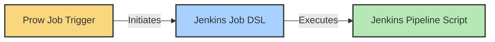

# Core Concepts for CI System

## CI Servers

- `prow.tidb.net` is the our Prow CI site, you can view the builds for you pull request, merging history of a repository.
- `https://do.pingcap.net/jenkins` is the backend CI worker (Jenkins) to run the heavy builds/tests for Prow jobs.

## CI Job Components

A complete CI pipeline consists of three main components:

| Component | Location | Purpose |
|-----------|----------|---------|
| **Prow Job Trigger** | `/prow-jobs/<org>/<repo>/` | Defines when and under what conditions jobs run |
| **Jenkins Job DSL** | `/jobs/<org>/<repo>/` | Configures the Jenkins job settings and parameters |
| **Jenkins Pipeline Script** | `/pipelines/<org>/<repo>/` | Contains the actual implementation steps |
