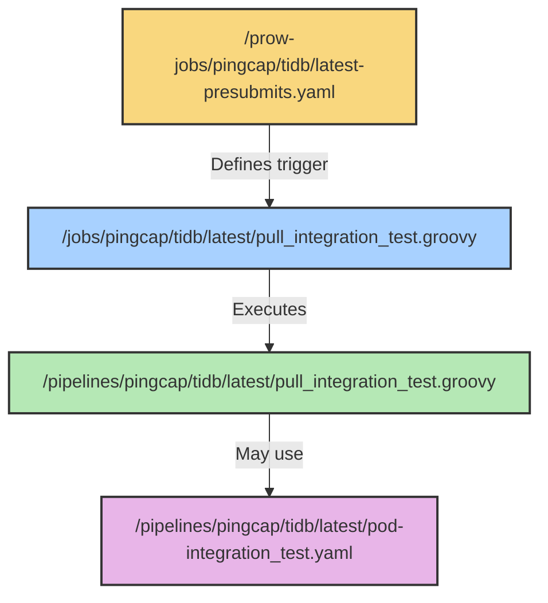

# Design for CI services and flows

## Folder Structure

- `/docs` - Documentation about CI/CD jobs, tools, and usage guides
- `/prow-jobs` - Top-level Prow job trigger configurations
- `/jobs` - Jenkins CI job DSL definition files (called by Prow jobs)
- `/pipelines` - Jenkins pipeline script implementations
- `/tekton` - Tekton CI/CD static resources definitions
- `/libraries` - Jenkins CI shared libraries
- [Deprecated] `/jenkins/jobs` - Legacy CI job DSL files for old CI servers
- [Deprecated] `/jenkins/pipelines` - Legacy pipeline scripts for old CI servers

## File Structure and Naming Conventions

### Prow Jobs

Located at `/prow-jobs/<org>/<repo>/<branch-special>-<job-type>.yaml`:

- **Branch specifiers**:
  - `latest` - For trunk and feature branches
  - `release-x.y` - For specific release branches
  - Omit if all branches use the same configuration

- **Job types**:
  - `presubmits` - Run on pull requests
  - `postsubmits` - Run on pull request merges
  - `periodics` - Run on a schedule

After modifying Prow jobs, update the kustomization file:
```bash
.ci/update-prow-job-kustomization.sh
```

### Jenkins Jobs

Located at `/jobs/<org>/<repo>/<branch-special>/<job-type>_<job-name>.groovy`:

- **Branch specifiers**:
  - `latest` - For trunk and feature branches
  - `release-x.y` - For specific release branches (e.g., release-8.5)
  - `release-x.y.z` - For patch version branches (hotfixes)
  - Omit if all branches use the same configuration

- **Job types**:
  - `pull` - Run on pull requests (works with Prow `presubmits`)
  - `merged` - Run on merges (works with Prow `postsubmits`)
  - `periodics` - Run on schedule (works with Prow `periodics`)

- **Job name format**: `[a-z][a-z0-9_]*[a-z0-9]`

- Special file `aa_folder.groovy` defines folder names (do not modify this filename)

### Jenkins Pipelines

Located at `/pipelines/<org>/<repo>/<branch-special>/`:

- **Pipeline scripts**: `*.groovy` files containing the Jenkins pipeline implementation
- **Pod templates**: `pod-*.yaml` files defining Kubernetes pod configurations for the pipeline


### Tekton Resources

Located at `/tekton/v<Number>/`:

- **Pipelines**: `pipelines/*.yaml` files defining Tekton Pipeline resources
- **Tasks**: `tasks/*.yaml` files defining reusable Tekton Task resources
- **Triggers**: `triggers/*.yaml` files for EventListener, TriggerTemplate, and TriggerBinding
- **Naming conventions**:
  - Use lowercase with hyphens: `[a-z][a-z0-9-]*[a-z0-9]`

## Example: Complete CI Pipeline Structure

For a typical pull request test in the TiDB repository:


