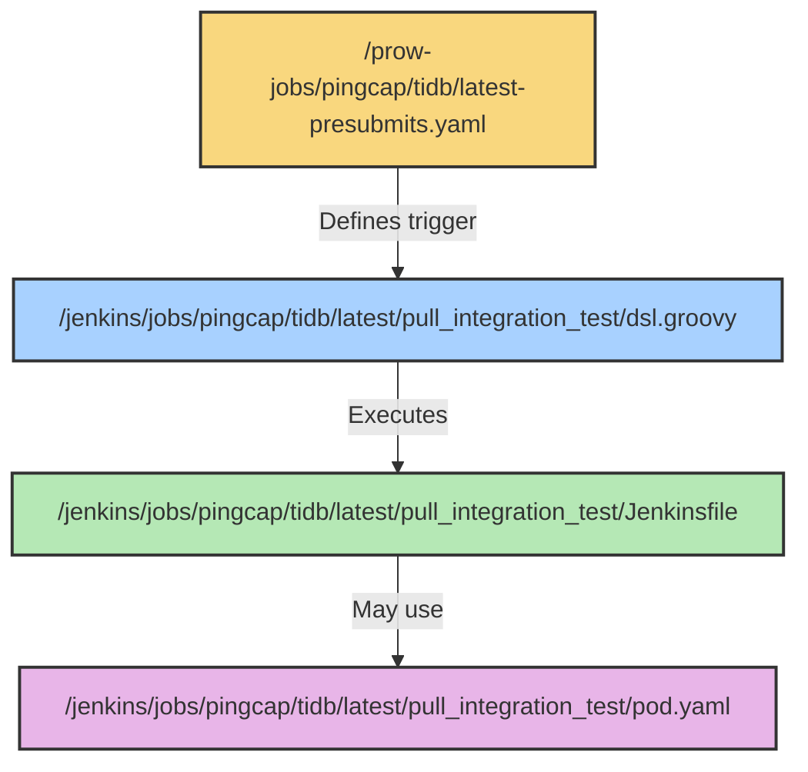

# Design for CI services and flows

## Folder Structure

- `/docs` - Documentation about CI/CD jobs, tools, and usage guides
- `/prow-jobs` - Top-level Prow job trigger configurations
- `/jenkins/jobs` - Jenkins job definitions, one folder per job (Job DSL, pipeline and pod template co-located)
- `/tekton` - Tekton CI/CD static resources definitions
- `/libraries` - Jenkins CI shared libraries

## File Structure and Naming Conventions

### Prow Jobs

Located at `/prow-jobs/<org>/<repo>/<branch-special>-<job-type>.yaml`:

- **Branch specifiers**:
  - `latest` - For trunk and feature branches
  - `release-x.y` - For specific release branches
  - Omit if all branches use the same configuration

- **Job types**:
  - `presubmits` - Run on pull requests
  - `postsubmits` - Run on pull request merges
  - `periodics` - Run on a schedule

After modifying Prow jobs, update the kustomization file:
```bash
.ci/update-prow-job-kustomization.sh
```

### Jenkins Jobs

Located at `/jenkins/jobs/<org>/<repo>/<branch-special>/<job>/`, one folder per job:

- `dsl.groovy` - Jenkins Job DSL (`pipelineJob`); its `scriptPath` points at the sibling `Jenkinsfile`
- `Jenkinsfile` - declarative pipeline implementation
- `pod.yaml` - Kubernetes pod template (optional); when the job has several templates use
  `pod-<purpose>.yaml` (`pod-build.yaml`, `pod-test.yaml`, `pod-main.yaml`, ...). Do not
  repeat the job name in the file name - the job folder already carries it

- **Branch specifiers**:
  - `latest` - For trunk and feature branches
  - `release-x.y` - For specific release branches (e.g., release-8.5)
  - `release-x.y.z` - For patch version branches (hotfixes)
  - Omit if all branches use the same configuration

- **Job name format**: `[a-z][a-z0-9_]*[a-z0-9]`

- Special file `aa_folder.groovy` defines folder names, one level above the job folders
  (do not modify this filename)

### Tekton Resources

Located at `/tekton/v<Number>/`:

- **Pipelines**: `pipelines/*.yaml` files defining Tekton Pipeline resources
- **Tasks**: `tasks/*.yaml` files defining reusable Tekton Task resources
- **Triggers**: `triggers/*.yaml` files for EventListener, TriggerTemplate, and TriggerBinding
- **Naming conventions**:
  - Use lowercase with hyphens: `[a-z][a-z0-9-]*[a-z0-9]`

## Example: Complete CI Pipeline Structure

For a typical pull request test in the TiDB repository:


```mermaid
graph TD
    A["/prow-jobs/pingcap/tidb/latest-presubmits.yaml"] -->|Defines trigger| B["/jenkins/jobs/pingcap/tidb/latest/pull_integration_test/dsl.groovy"]
    B -->|Executes| C["/jenkins/jobs/pingcap/tidb/latest/pull_integration_test/Jenkinsfile"]
    C -->|May use| D["/jenkins/jobs/pingcap/tidb/latest/pull_integration_test/pod.yaml"]

    style A fill:#f9d77e,stroke:#333,stroke-width:2px
    style B fill:#a8d1ff,stroke:#333,stroke-width:2px
    style C fill:#b5e8b5,stroke:#333,stroke-width:2px
    style D fill:#e8b5e8,stroke:#333,stroke-width:2px
```
