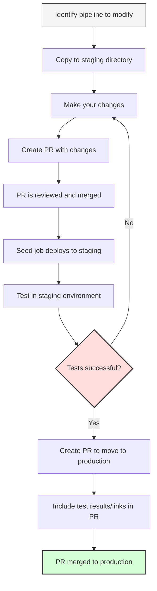

# CI Guides

Welcome to PingCAP's CI guides! This section contains detailed documentation and tutorials to help you get the most out of our CI.

## Finding Pipelines for a Specific Repository

For any repository (e.g., TiDB, TiKV, TiFlash), pipelines are organized in the following locations:

- `/prow-jobs/<org>/<repo>/` - Contains trigger configurations
- `/jenkins/jobs/<org>/<repo>/` - Contains Jenkins job definitions and pipeline implementations, one folder per job

For example, TiDB jobs are located at:
- `/prow-jobs/pingcap/tidb/`
- `/jenkins/jobs/pingcap/tidb/`

## How to Modify and Test a Pipeline

### Workflow Diagram


```mermaid
flowchart TD
    A[Identify pipeline to modify] --> B[Copy to staging directory]
    B --> C[Make your changes]
    C --> D[Create PR with changes]
    D --> E[PR is reviewed and merged]
    E --> F[Seed job deploys to staging]
    F --> G[Test in staging environment]
    G --> H{Tests successful?}
    H -->|Yes| I[Create PR to move to production]
    H -->|No| C
    I --> J[Include test results/links in PR]
    J --> K[PR merged to production]

    style A fill:#f5f5f5,stroke:#333,stroke-width:1px
    style H fill:#ffdddd,stroke:#333,stroke-width:2px
    style K fill:#d5ffd5,stroke:#333,stroke-width:2px
```

### Step-by-Step Guide

1. **Locate the job files**:
   - Find the job folder in `/jenkins/jobs/<org>/<repo>/<branch-special>/<job>/`
     (it contains `dsl.groovy`, `Jenkinsfile`, and an optional `pod.yaml` / `pod-<purpose>.yaml`)
   - Identify the Prow job trigger in `/prow-jobs/<org>/<repo>/<branch-special>-<job-type>.yaml`

2. **Make your changes**:
   - Always place your modifications in the corresponding `/staging` directory first
   - Maintain the same directory structure in staging as in production
   - For example, if modifying `/jenkins/jobs/pingcap/tidb/latest/pull_integration_test/Jenkinsfile`,
     place your modified version in `/staging/jenkins/jobs/pingcap/tidb/latest/pull_integration_test/Jenkinsfile`

3. **Test your changes**:
   - After your PR is merged, the seed job (automatically triggered by Prow) will deploy it to the staging CI server
   - Test the pipeline in the staging environment at https://prow.tidb.net/jenkins-staging/
   - Navigate to the corresponding job in the staging environment
   - Trigger a test run manually to verify your changes work as expected

4. **Deploy to production**:
   - Once testing is successful, create a new PR that moves the code from `/staging` to the top-level directories
   - Include links to your successful test jobs in the PR comments
   - After review and approval, your changes will be merged to production

## Pre-PR Verification for Jenkins Pipeline Changes

When your PR modifies pipeline files under `jenkins/jobs/**` (`Jenkinsfile`), run both static validation and replay tests before requesting review.

### 1. Static Groovy/Jenkinsfile Validation

Run Jenkins pipeline model validation for all Groovy pipelines:

```bash
JENKINS_URL=https://prow.tidb.net/jenkins .ci/verify-jenkins-pipelines.sh
```

This checks syntax/model validity through Jenkins API and is the fastest baseline check.

### 2. Real Replay Test for One Pipeline

Replay one historical build with your local pipeline script content:

```bash
.ci/replay-jenkins-build.sh \
  --script-file jenkins/jobs/pingcap/tidb/release-8.5/pull_integration_e2e_test/Jenkinsfile \
  --route-by-prow-master \
  --selector lastSuccessfulBuild \
  --verbose
```

Default behavior:
- Waits until queue assignment is finished and prints the new replay build URL.
- Does not wait for final build result unless `--wait` is provided.

### 3. Replay All Changed Pipelines in Current Workspace

Use `--auto-changed` to replay Jenkinsfiles changed directly or through their sibling `pod.yaml` or `pod-<purpose>.yaml` files from git diff:

```bash
.ci/replay-jenkins-build.sh \
  --auto-changed \
  --route-by-prow-master \
  --selector lastSuccessfulBuild \
  --max-replays 20 \
  --verbose
```

Notes:
- With `--route-by-prow-master`, set `JENKINS_MASTER_0_URL/USER/TOKEN` and
  `JENKINS_MASTER_1_URL/USER/TOKEN`. Each job uses its Prow `labels.master` to
  select the matching Jenkins instance. The script fails if the job has no
  unambiguous master label. This mode requires `yq`.
- If `--base-sha/--head-sha` are not provided, the script uses `origin/main..HEAD` (or `HEAD~1..HEAD` fallback).
- If `${job}/lastSuccessfulBuild` returns `404`, the script logs `skip replay (no historical build)` and continues with the next job.
- At the end, the script prints summary counts, for example:
  - `replay summary: submitted=3, skipped=2, failed=0`

### 4. PR-Level Automation in Prow

This repository has two related presubmit jobs for pipeline changes:

- `pull-verify-jenkins-pipelines`
  - Validates Jenkins pipeline syntax/model.
  - Triggered by pipeline file changes.
- `pull-verify-k8s-pod-yaml`
  - Verifies pipeline Pod YAML files stay structurally valid Kubernetes Pod manifests.
  - When in-cluster Kubernetes API access is available, injects a test `metadata.name` and also runs both `kubectl --dry-run=client --validate=strict` and `kubectl --dry-run=server --validate=strict`.
  - Triggered by `jenkins/jobs/**/pod*.yaml` changes.
- `pull-verify-pod-resource-policy`
  - Fails when a changed `jenkins/jobs/**/pod*.yaml` container declares memory `requests != limits` (or only one of request/limit), enforcing Guaranteed QoS and preventing new OOM/eviction-prone templates.
  - CPU mismatches are reported as warnings only (the Pod stays Burstable).
  - Exemptions are registered in `.ci/pod-resource-policy-allowlist.txt` with format `<path-regex><TAB><container><TAB><review-date><TAB><reason>`; expired entries no longer exempt.
  - Runs `.ci/test-verify-pod-resource-policy.sh` (positive and negative fixtures including allowlist and expiry cases) before the check.
  - Triggered by `jenkins/jobs/**/pod*.yaml` or the policy script/allowlist changes.
- `pull-verify-secret-scan`
  - Triggered only when changed files are in the Jenkins credentials-risk surface:
    `jenkins/jobs/**`, `libraries/**`, `prow-jobs/**` (`*.groovy|*.yml|*.yaml`).
  - Uses pinned scanner image digest and explicit timeout for predictable operations.
  - Runs two fail-fast checks:
    - Jenkins credential policy check (`bash .ci/verify-jenkins-credential-policy.sh`) to block obvious insecure patterns such as secret-like literal assignments, secret value echo, and secret-like env vars with direct `value:` in Prow YAML.
    - Incremental gitleaks check (`.ci/verify-secret-scan.sh`) on `${PULL_BASE_SHA}..${PULL_PULL_SHA}` instead of whole-repo scan.
  - Supports explicit exemptions via `.ci/security-policy-allowlist.txt`:
    - format: `<rule><TAB><path-regex>`
    - supported rules: `hardcoded_literal`, `secret_echo`, `secret_env_plain_value`
    - exemptions should be narrow and path-scoped to avoid broad bypasses.
- `pull-test-security-policy-scripts`
  - Runs regression tests for `.ci/verify-jenkins-credential-policy.sh` with both positive and negative fixtures.
  - Includes allowlist regression fixtures (allowlisted vs non-allowlisted secret echo).
  - Triggered when `.ci/verify-jenkins-credential-policy.sh`, `.ci/test-verify-jenkins-credential-policy.sh`, or `.ci/security-policy-allowlist.txt` changes.
- `pull-replay-jenkins-pipelines`
  - Optional replay validation using `--auto-changed`.
  - Triggered by changes to a job folder’s `Jenkinsfile`, `pod.yaml`, or `pod-<purpose>.yaml`; pod-only changes replay the sibling Jenkinsfile.
  - Trigger manually in PR comments:
    - `/test pull-replay-jenkins-pipelines`
  - Replays each job on the Jenkins instance selected by its Prow `labels.master`.
