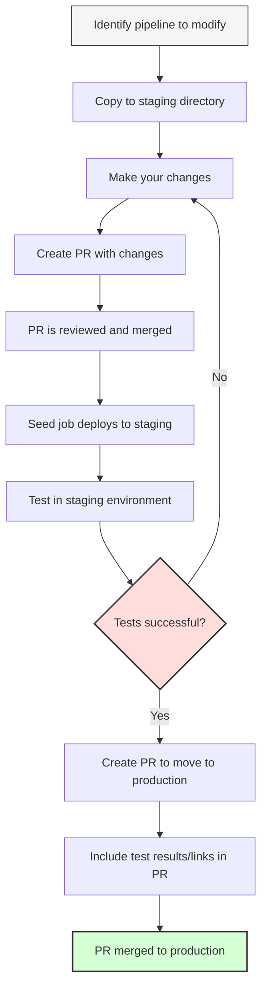

# CI Guides

Welcome to PingCAP's CI guides! This section contains detailed documentation and tutorials to help you get the most out of our CI.

## Finding Pipelines for a Specific Repository

For any repository (e.g., TiDB, TiKV, TiFlash), pipelines are organized in the following locations:

- `/prow-jobs/<org>/<repo>/` - Contains trigger configurations
- `/jobs/<org>/<repo>/` - Contains Jenkins job definitions
- `/pipelines/<org>/<repo>/` - Contains pipeline implementation scripts

For example, TiDB pipelines are located at:
- `/prow-jobs/pingcap/tidb/`
- `/jobs/pingcap/tidb/`
- `/pipelines/pingcap/tidb/`

## How to Modify and Test a Pipeline

### Workflow Diagram



### Step-by-Step Guide

1. **Locate the pipeline files**:
   - Find the Jenkins job definition in `/jobs/<org>/<repo>/<branch-special>/<job-type>_<job-name>.groovy`
   - Find the pipeline implementation in `/pipelines/<org>/<repo>/<branch-special>/`
   - Identify the Prow job trigger in `/prow-jobs/<org>/<repo>/<branch-special>-<job-type>.yaml`

2. **Make your changes**:
   - Always place your modifications in the corresponding `/staging` directory first
   - Maintain the same directory structure in staging as in production
   - For example, if modifying `/jobs/pingcap/tidb/latest/pull_integration_test.groovy`,
     place your modified version in `/staging/jobs/pingcap/tidb/latest/pull_integration_test.groovy`

3. **Test your changes**:
   - After your PR is merged, the seed job (automatically triggered by Prow) will deploy it to the staging CI server
   - Test the pipeline in the staging environment at https://do.pingcap.net/jenkins-beta/
   - Navigate to the corresponding job in the staging environment
   - Trigger a test run manually to verify your changes work as expected

4. **Deploy to production**:
   - Once testing is successful, create a new PR that moves the code from `/staging` to the top-level directories
   - Include links to your successful test jobs in the PR comments
   - After review and approval, your changes will be merged to production

## Pre-PR Verification for Jenkins Pipeline Changes

When your PR modifies files under `pipelines/**/*.groovy`, run both static validation and replay tests before requesting review.

### 1. Static Groovy/Jenkinsfile Validation

Run Jenkins pipeline model validation for all Groovy pipelines:

```bash
JENKINS_URL=https://do.pingcap.net/jenkins .ci/verify-jenkins-pipelines.sh
```

This checks syntax/model validity through Jenkins API and is the fastest baseline check.

### 2. Real Replay Test for One Pipeline

Replay one historical build with your local pipeline script content:

```bash
JENKINS_USER="<jenkins-user>" \
JENKINS_TOKEN="<jenkins-token>" \
.ci/replay-jenkins-build.sh \
  --script-file pipelines/pingcap/tidb/release-8.5/pull_integration_e2e_test.groovy \
  --jenkins-url https://do.pingcap.net/jenkins \
  --selector lastSuccessfulBuild \
  --verbose
```

Default behavior:
- Waits until queue assignment is finished and prints the new replay build URL.
- Does not wait for final build result unless `--wait` is provided.

### 3. Replay All Changed Pipelines in Current Workspace

Use `--auto-changed` to replay all changed `pipelines/*.groovy` files from git diff:

```bash
JENKINS_USER="<jenkins-user>" \
JENKINS_TOKEN="<jenkins-token>" \
.ci/replay-jenkins-build.sh \
  --auto-changed \
  --jenkins-url https://do.pingcap.net/jenkins \
  --selector lastSuccessfulBuild \
  --max-replays 20 \
  --verbose
```

Notes:
- If `--base-sha/--head-sha` are not provided, the script uses `origin/main..HEAD` (or `HEAD~1..HEAD` fallback).
- If `${job}/lastSuccessfulBuild` returns `404`, the script logs `skip replay (no historical build)` and continues with the next job.
- At the end, the script prints summary counts, for example:
  - `replay summary: submitted=3, skipped=2, failed=0`

### 4. PR-Level Automation in Prow

This repository has two related presubmit jobs for pipeline changes:

- `pull-verify-jenkins-pipelines`
  - Validates Jenkins pipeline syntax/model.
  - Triggered by pipeline file changes.
- `pull-replay-jenkins-pipelines`
  - Optional replay validation using `--auto-changed`.
  - Trigger manually in PR comments:
    - `/test pull-replay-jenkins-pipelines`
  - Replays against `https://do.pingcap.net/jenkins-beta`.
