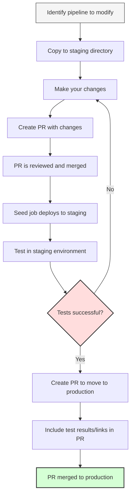

# CI Guides

Welcome to PingCAP's CI guides! This section contains detailed documentation and tutorials to help you get the most out of our CI.

## Finding Pipelines for a Specific Repository

For any repository (e.g., TiDB, TiKV, TiFlash), pipelines are organized in the following locations:

- `/prow-jobs/<org>/<repo>/` - Contains trigger configurations
- `/jobs/<org>/<repo>/` - Contains Jenkins job definitions
- `/pipelines/<org>/<repo>/` - Contains pipeline implementation scripts

For example, TiDB pipelines are located at:
- `/prow-jobs/pingcap/tidb/`
- `/jobs/pingcap/tidb/`
- `/pipelines/pingcap/tidb/`

## How to Modify and Test a Pipeline

### Workflow Diagram

### Step-by-Step Guide

1. **Locate the pipeline files**:
   - Find the Jenkins job definition in `/jobs/<org>/<repo>/<branch-special>/<job-type>_<job-name>.groovy`
   - Find the pipeline implementation in `/pipelines/<org>/<repo>/<branch-special>/`
   - Identify the Prow job trigger in `/prow-jobs/<org>/<repo>/<branch-special>-<job-type>.yaml`

2. **Make your changes**:
   - Always place your modifications in the corresponding `/staging` directory first
   - Maintain the same directory structure in staging as in production
   - For example, if modifying `/jobs/pingcap/tidb/latest/pull_integration_test.groovy`,
     place your modified version in `/staging/jobs/pingcap/tidb/latest/pull_integration_test.groovy`

3. **Test your changes**:
   - After your PR is merged, the seed job(automatic triggered by Prow) will deploy it to the staging CI server
   - Test the pipeline in the staging environment at https://do.pingcap.net/jenkins-beta/
   - Navigate to the corresponding job in the staging environment
   - Trigger a test run manually to verify your changes work as expected

4. **Deploy to production**:
   - Once testing is successful, create a new PR that moves the code from `/staging` to the top-level directories
   - Include links to your successful test jobs in the PR comments
   - After review and approval, your changes will be merged to production

## More Information

- [FAQ](./FAQ.md)
- [Docker Build](./docker-build.md)
  > Learn how to find the Dockerfile to build from source to image.
