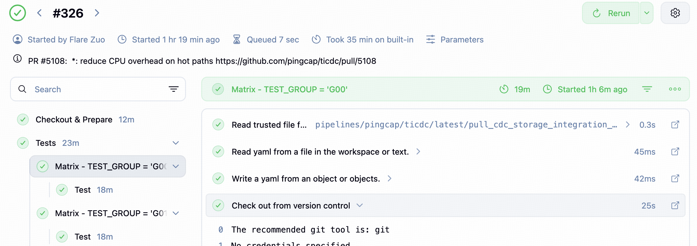
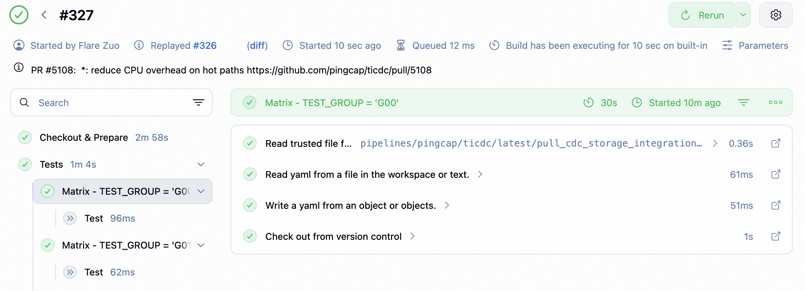

# matrixCache

`matrixCache` 是一个面向 Jenkins matrix stage 重跑场景的小型缓存工具。它会在某个 matrix axis 成功后写入一个本地 marker 文件；同一代码上下文再次重跑时，已经成功过的 axis 可以直接跳过，只执行尚未成功的部分。

## 背景

在大型 CI pipeline 里，matrix stage 往往会把同一类测试拆成很多 axis 并行执行，例如按 `TEST_GROUP`、`OS`、`ARCH` 或其他维度拆分。

这类任务有一个常见问题：如果某一次构建里只有少数 axis 因为偶发环境问题失败，重跑整个 pipeline 时，之前已经成功的 axis 也会被完整再跑一遍。这会带来几个直接问题：

- 拉长重跑时间，反馈更慢
- 占用更多 Jenkins agent、容器和存储资源
- 让真正需要关注的失败 axis 淹没在重复执行里

`matrixCache` 的目标就是解决这个问题：在不改变原有 stage 逻辑的前提下，让 matrix stage 在重跑时自动跳过已经成功的 axis。

## 设计

`matrixCache` 的核心思路很简单：为“当前代码上下文 + 当前 stage + 当前 axis 参数”生成一个稳定 key，并在 Jenkins master 本地文件系统上保存一个 success marker。

### key 组成

共享库位于 `libraries/tisys/vars/matrixCache.groovy`。它会把下面这些信息拼成原始字符串：

- `refs.org`
- `refs.repo`
- `refs.base_sha`
- `refs.pulls[*].sha`
- 调用方传入的 `stageName`
- 调用方传入的 `extraParams`

原始格式等价于：

```text
org/repo/baseSha/pullShas/stageName/extras
```

其中 `extraParams` 会先按 key 排序再拼接，因此同一组参数即使 Map 的书写顺序不同，最终 key 仍然稳定。

为了避免文件名过长，库会对这个原始字符串做一次 MD5，得到最终缓存 key。

### marker 存储位置

marker 文件保存在：

```text
${JENKINS_HOME}/matrix-cache/${JOB_NAME.replaceAll('/', '_')}/${key}.success
```

这意味着缓存具有下面几个边界：

- 缓存范围按 `JOB_NAME` 隔离，不同 Jenkins job 不共享
- 缓存存储在 Jenkins master 本地文件系统，不是远端共享缓存
- 只要 `refs`、`stageName`、`extraParams` 中任意一个维度变化，就会命中新 key

## 实现

### 共享库接口

`matrixCache` 暴露了两个最核心的方法：

```groovy
def shouldSkip(Map refs, String stageName, Map extraParams = [:]) {
    def key = _generateContextKey(refs, stageName, extraParams)
    def cacheDir = new File("${env.JENKINS_HOME}/matrix-cache/${env.JOB_NAME.replaceAll('/', '_')}")
    def markerFile = new File(cacheDir, "${key}.success")
    return markerFile.exists()
}

def markDone(Map refs, String stageName, Map extraParams = [:]) {
    def key = _generateContextKey(refs, stageName, extraParams)
    def cacheDir = new File("${env.JENKINS_HOME}/matrix-cache/${env.JOB_NAME.replaceAll('/', '_')}")
    if (!cacheDir.exists()) cacheDir.mkdirs()

    def markerFile = new File(cacheDir, "${key}.success")
    if (!markerFile.exists()) {
        markerFile.text = "SUCCESS"
    }
}
```

行为分别是：

- `shouldSkip()`：在 stage 开始前检查 success marker 是否已存在
- `markDone()`：在 stage 成功后写入 success marker

`markDone()` 只会在 `post { success {} }` 中调用，因此失败的 axis 不会污染缓存。

### Pipeline 集成方式

在 pipeline 里，推荐的接入方式是：

1. 在 `when` 中调用 `shouldSkip()`
2. 在 `post { success {} }` 中调用 `markDone()`
3. 两次调用必须使用完全相同的 `stageName` 和 `extraParams`

ticdc 试点任务 `pipelines/pingcap/ticdc/latest/pull_cdc_storage_integration_light_next_gen/pipeline.groovy` 的接入方式如下：

```groovy
stage("Test") {
    when {
        expression {
            return !matrixCache.shouldSkip(REFS, 'Test', [test_group: env.TEST_GROUP])
        }
    }
    steps {
        sh label: "${TEST_GROUP}", script: """
            ./tests/integration_tests/run_light_it_in_ci.sh storage ${TEST_GROUP}
        """
    }
    post {
        success {
            script {
                matrixCache.markDone(REFS, 'Test', [test_group: env.TEST_GROUP])
            }
        }
    }
}
```

这里使用了稳定的 stage key `'Test'`，并把 matrix 维度 `[test_group: env.TEST_GROUP]` 显式传给两个调用点，使读写缓存时使用的 key 完全一致。

## 用法

### 适用场景

`matrixCache` 适合下面这类 stage：

- stage 本身是幂等的，重跑不会依赖上一次残留状态
- 某个 axis 成功后，再跑一次通常只是在重复消耗资源
- 你希望只对“同一代码上下文”复用结果，而不是跨提交共享结果

### 接入步骤

1. 选一个稳定的 `stageName`
2. 选出能够唯一标识当前 axis 的参数，放进 `extraParams`
3. 在 `when` 中调用 `!matrixCache.shouldSkip(...)`
4. 在 `post { success {} }` 中调用 `matrixCache.markDone(...)`
5. 确保两次调用的 `refs`、`stageName`、`extraParams` 完全一致

通用示例如下：

```groovy
stage("Unit Test") {
    when {
        expression {
            return !matrixCache.shouldSkip(
                REFS,
                'Unit Test',
                [os: env.OS, arch: env.ARCH]
            )
        }
    }
    steps {
        sh "make test"
    }
    post {
        success {
            script {
                matrixCache.markDone(
                    REFS,
                    'Unit Test',
                    [os: env.OS, arch: env.ARCH]
                )
            }
        }
    }
}
```

### 注意事项

- 不要在 matrix 场景里依赖 `env.STAGE_NAME` 作为缓存 key 的一部分。Jenkins 存在 `JENKINS-69394`，`when` 和 `post` 上下文里的 `env.STAGE_NAME` 可能不一致。
- `shouldSkip()` 和 `markDone()` 的 `stageName`、`extraParams` 必须完全相同，否则会出现“读一个 key、写另一个 key”的情况。
- `extraParams` 必须覆盖所有真正影响结果的 axis 维度。漏掉某个维度会导致错误命中缓存。
- 缓存落在 Jenkins master 本地文件系统；如果切换了 Jenkins master、清理了 `${JENKINS_HOME}`，或者 job 名称变化，旧缓存不会继续生效。

## 效果例子

下面的截图来自 ticdc 试点任务 `pull_cdc_storage_integration_light_next_gen`。

### 初次执行

第一次运行时，所有 `TEST_GROUP` axis 都会正常执行 `Test` stage。



### 同一上下文重跑

当相同代码上下文再次重跑时，已经成功过的 axis 会被快速跳过，界面上可以看到 `Test` 直接进入 `SKIPPED`/跳过状态，只保留真正需要补跑的部分。


